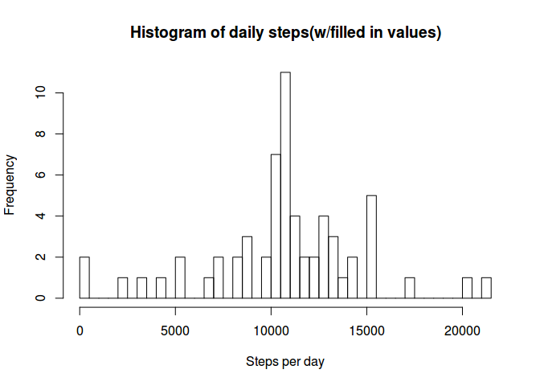

# Reproducible Research: Peer Assessment 1


## Loading and preprocessing the data

```r
unzip('activity.zip')
act<-read.csv('activity.csv')
```

## What is mean total number of steps taken per day?

```r
act_cc<-na.omit(act)
steps_per_day<-aggregate(act_cc$steps, by=list(Day=act_cc$date), FUN=sum)
hist(steps_per_day$x,breaks=50,main="Histogram of daily steps",xlab="Steps per day")
```

 

```r
steps_mean=mean(steps_per_day$x)
steps_median=median(steps_per_day$x)
```
Mean of daily steps:

```r
steps_mean
```

```
## [1] 10766.19
```
Median of daily steps:

```r
steps_median
```

```
## [1] 10765
```


## What is the average daily activity pattern?

```r
mean_per_interval<-aggregate(act_cc$steps, by=list(time_of_day=act_cc$interval), FUN=mean)
plot(mean_per_interval,type="l",main="Average steps per time(5 min interval) of the day",xlab="Time of the day",ylab="Average steps")
```

 


This is the interval with the highest mean:

```r
mean_per_interval[mean_per_interval$x==max(mean_per_interval$x),]
```

```
##     time_of_day        x
## 104         835 206.1698
```


## Imputing missing values

```r
sum(is.na(act))
```

```
## [1] 2304
```
I copy the original data into a new one, as working data:

### I will use a for loop, it comes more intuitive to me, even if I am sure there are functions to 'join' vectors.
I loop thru the original vector and whenever I find that steps=NA I replace the value with the mean I calculated previously matching by the interval.


```r
act_mv<-act
for (i in 1:nrow(act)) {
    # check if the "steps" value is missing
    if(is.na(act$steps[i])) {
        # if so, replace the missing value with the mean for that interval
        act_mv$steps[i] <- mean_per_interval$x[which(mean_per_interval$time_of_day==act_mv$interval[i])]
    }
}
```

Let's make the new histogram:

```r
steps_per_day_new<-aggregate(act_mv$steps, by=list(Day=act_mv$date), FUN=sum)
hist(steps_per_day_new$x,breaks=50,main="Histogram of daily steps",xlab="Steps per day")
```

 

```r
steps_mean_new=mean(steps_per_day_new$x)
steps_median_new=median(steps_per_day_new$x)
```

New Mean of daily steps:

```r
steps_mean_new
```

```
## [1] 10766.19
```

New Median of daily steps:

```r
steps_median_new
```

```
## [1] 10766.19
```

## Are there differences in activity patterns between weekdays and weekends?

We add a column to the dataframe containing the label to tell if it's weekday or weekend.

```r
type_of_day <- function(date) {
    if (weekdays(as.Date(date)) %in% c("Saturday", "Sunday")) {
        "Weekend"
    } else {
        "Weekday"
    }
}
act_mv$type_of_day <- as.factor(sapply(act_mv$date, type_of_day))
```

Now we can plot the data splitting by type of day:


```r
par(mfrow = c(2, 1))
for (type in c("Weekend", "Weekday")) {
    steps.type <- aggregate(steps ~ interval, data = act_mv, subset = act_mv$type_of_day ==  type, FUN = mean)
    plot(steps.type, type = "l", main = type,ylab="Steps",xlab="Time of day(Interval)")
}
```

 


